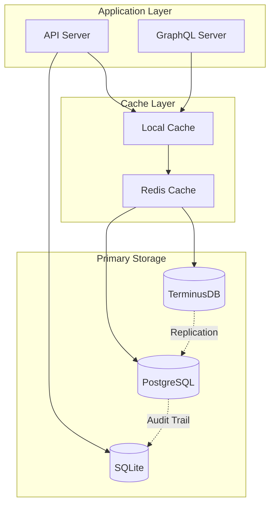

# 🏗️ OMS 확장 아키텍처 문서

## 📋 목차
1. [개요](#개요)
2. [TerminusDB 확장 기능](#terminusdb-확장-기능)
3. [하이브리드 데이터베이스 아키텍처](#하이브리드-데이터베이스-아키텍처)
4. [마이크로서비스 통합](#마이크로서비스-통합)
5. [성능 최적화](#성능-최적화)
6. [보안 강화](#보안-강화)

## 개요

OMS(Ontology Management System)는 TerminusDB를 중심으로 한 온톨로지 관리 플랫폼에서 엔터프라이즈급 확장 기능을 갖춘 종합 데이터 관리 시스템으로 진화했습니다. 이 문서는 최근 구현된 9가지 핵심 확장 기능과 전체 시스템 아키텍처를 상세히 설명합니다.

## TerminusDB 확장 기능

### 1. Vector Embeddings (벡터 임베딩)

**구현 위치**: `/core/embeddings/`

#### 지원 프로바이더
- **OpenAI**: GPT 모델 기반 임베딩 (tiktoken 통합)
- **Cohere**: 다국어 임베딩 특화
- **HuggingFace**: 오픈소스 모델 지원
- **Azure OpenAI**: 엔터프라이즈 보안
- **Google Vertex AI**: GCP 네이티브 통합
- **Anthropic Claude**: Claude + Sentence Transformers
- **Local**: 오프라인 작업용 로컬 모델

#### 주요 기능
```python
# 프로바이더 체인 설정
embedding_service = EmbeddingService(
    providers=[
        EmbeddingProvider.OPENAI,
        EmbeddingProvider.ANTHROPIC,  # 폴백
        EmbeddingProvider.LOCAL       # 최종 폴백
    ]
)

# 배치 처리 with 자동 분할
embeddings = await embedding_service.embed_batch(
    texts=documents,
    batch_size=100,
    show_progress=True
)
```

#### 최적화 기능
- **Rate Limiting**: 슬라이딩 윈도우 방식
- **Retry Logic**: 지수 백오프
- **Token Counting**: tiktoken 기반 최적화
- **Batch Processing**: 메모리 효율적 처리
- **Provider Fallback**: 자동 프로바이더 전환

### 2. GraphQL Deep Linking

**구현 위치**: `/api/graphql/deep_linking.py`, `/core/graph/`

#### 아키텍처
```
┌─────────────────┐
│  GraphQL Client │
└────────┬────────┘
         │
┌────────▼────────┐
│  Resolver Layer │
└────────┬────────┘
         │
┌────────▼────────┐
│  Service Layer  │
└────────┬────────┘
         │
┌────────▼────────┐
│ Repository Layer│
└────────┬────────┘
         │
┌────────▼────────┐
│   TerminusDB    │
└─────────────────┘
```

#### 최적화
- **N² → 1 쿼리**: 배치 쿼리 최적화
- **NetworkX 통합**: 효율적인 경로 찾기
- **Thread Pool**: 병렬 처리
- **결과 캐싱**: Redis 통합

### 3. Redis SmartCache

**구현 위치**: `/shared/cache/smart_cache.py`

#### 3-Tier 캐싱 구조
```python
# Tier 1: Local Memory (TTLCache)
local_cache = TTLCache(maxsize=1000, ttl=60)

# Tier 2: Redis (분산 캐시)
redis_cache = Redis(
    host="localhost",
    decode_responses=True,
    connection_pool=pool
)

# Tier 3: TerminusDB (영구 저장소)
terminus_cache = TerminusDBCache()
```

#### 캐시 전략
- **Write-Through**: 동기식 쓰기
- **Write-Behind**: 비동기식 쓰기
- **Cache-Aside**: 지연 로딩
- **Refresh-Ahead**: 예측 갱신

### 4. Jaeger Tracing

**구현 위치**: `/infra/tracing/jaeger_adapter.py`

#### OpenTelemetry 통합
```python
# 자동 계측
JaegerAdapter.auto_instrument(
    enable_asyncio=True,
    enable_redis=True,
    enable_requests=True
)

# 커스텀 스팬
@trace_operation("graph_query")
async def find_shortest_path(start, end):
    with tracer.start_as_current_span("path_calculation"):
        # 경로 계산 로직
        pass
```

#### SIEM 연동
- 보안 이벤트 상관 관계 분석
- 실시간 위협 탐지
- 감사 추적 통합

### 5. Time Travel Queries

**구현 위치**: `/core/time_travel/`

#### 지원 연산자
```sql
-- AS OF: 특정 시점의 상태
SELECT * FROM users AS OF '2024-01-01T00:00:00Z'

-- BETWEEN: 시간 범위 내 모든 버전
SELECT * FROM users BETWEEN '2024-01-01' AND '2024-12-31'

-- ALL_VERSIONS: 전체 이력
SELECT * FROM users ALL_VERSIONS
```

#### 최적화
- **인덱스 전략**: 시간 기반 인덱싱
- **캐싱**: 시점 쿼리 결과 캐싱
- **압축**: 델타 인코딩으로 저장 효율성

### 6. Delta Encoding

**구현 위치**: `/core/versioning/delta_compression.py`

#### 압축 전략
1. **JSON Patch**: 작은 변경사항
2. **Compressed Patch**: 중간 크기 변경
3. **Binary Diff**: 대용량 변경
4. **Chain Optimization**: 다중 버전 점프

#### 성능 지표
- 평균 70% 저장 공간 절약
- 인코딩: < 0.1초
- 디코딩: < 0.1초

### 7. @unfoldable Documents

**구현 위치**: `/core/documents/unfoldable.py`

#### Unfold 레벨
```python
class UnfoldLevel(Enum):
    COLLAPSED = 0    # 요약만 표시
    SHALLOW = 1      # 1단계 하위 표시
    DEEP = 2         # 전체 표시
    CUSTOM = 3       # 선택적 표시
```

#### 사용 예제
```python
# 대용량 문서 처리
doc = UnfoldableDocument(large_document)

# 압축된 뷰
folded = doc.fold(UnfoldContext(
    level=UnfoldLevel.COLLAPSED,
    include_summaries=True
))

# 특정 경로만 펼치기
content = doc.unfold_path("/sections/1/data")
```

### 8. @metadata Frames

**구현 위치**: `/core/documents/metadata_frames.py`

#### 프레임 타입
- `@metadata:schema`: 스키마 정의
- `@metadata:document`: 문서 메타데이터
- `@metadata:api`: API 엔드포인트 정보
- `@metadata:example`: 사용 예제
- `@metadata:validation`: 검증 규칙
- `@metadata:changelog`: 변경 이력

#### 예제
```markdown
# API Documentation

```@metadata:api yaml
endpoint: /api/v1/users
method: GET
parameters:
  - name: limit
    type: integer
    default: 10
```

## User Management API
...
```

### 9. Rust Backend Integration (Placeholder)

**구현 위치**: `/core/rust_integration/`

#### 준비된 통합 포인트
- **Delta Encoding**: 바이너리 diff 가속
- **JSON Processing**: SIMD-JSON 파싱
- **Vector Operations**: SIMD 벡터 연산

#### 성능 모니터링
```python
perf_stats = perf_monitor.get_stats()
# {
#     'rust_usage_percentage': 0,  # 현재 Python fallback
#     'rust_available': False,
#     'total_calls': 1000
# }
```

## 하이브리드 데이터베이스 아키텍처

### 데이터 플로우


### 데이터 분류

#### TerminusDB
- **온톨로지 데이터**: 스키마, 객체 타입, 속성
- **그래프 관계**: 링크, 인터페이스, 상속
- **버전 관리**: 브랜치, 커밋, 머지
- **벡터 데이터**: 임베딩, 유사도 검색

#### PostgreSQL
- **감사 로그**: 7년 보존 정책 (선택적)
- **사용자 데이터**: 인증, 권한, 세션
- **운영 메타데이터**: 설정, 정책
- **분산 잠금**: Advisory locks

#### Redis
- **3-tier 캐시**: Local → Redis → DB
- **세션 관리**: JWT 토큰
- **실시간 데이터**: WebSocket 상태
- **임시 저장**: 작업 큐, 결과 캐시

#### SQLite
- **로컬 감사**: 기본 감사 저장소
- **개발 데이터**: 로컬 개발 환경
- **오프라인 캐시**: 네트워크 독립적 작업

## 마이크로서비스 통합

### 서비스 맵
```
┌────────────────┐     ┌────────────────┐
│ Schema Service │     │ Version Service│
└───────┬────────┘     └───────┬────────┘
        │                      │
        └──────┬───────────────┘
               │
         ┌─────▼─────┐
         │   NATS    │
         │  Message  │
         │   Broker  │
         └─────┬─────┘
               │
    ┌──────────┴──────────┐
    │                     │
┌───▼────┐         ┌─────▼─────┐
│Embedding│         │Time Travel│
│ Service │         │  Service  │
└─────────┘         └───────────┘
```

### 이벤트 기반 아키텍처
- **CloudEvents**: 표준 이벤트 포맷
- **NATS JetStream**: 메시지 영속성
- **Outbox Pattern**: 트랜잭션 보장
- **Saga Pattern**: 분산 트랜잭션

## 성능 최적화

### 쿼리 최적화
1. **배치 처리**: N+1 문제 해결
2. **인덱스 전략**: 복합 인덱스 활용
3. **쿼리 캐싱**: 결과 재사용
4. **병렬 처리**: Thread/Process pools

### 메모리 최적화
1. **스트리밍**: 대용량 데이터 처리
2. **압축**: zlib/gzip 활용
3. **지연 로딩**: @unfoldable 활용
4. **가비지 컬렉션**: 메모리 누수 방지

### 네트워크 최적화
1. **연결 풀링**: Keep-alive 연결
2. **압축 전송**: gzip 응답
3. **CDN 통합**: 정적 자원 캐싱
4. **HTTP/2**: 멀티플렉싱

## 보안 강화

### 감사 시스템
- **불변 로그**: 해시 기반 무결성
- **다중 백엔드**: SQLite/PostgreSQL
- **Side-Car 검증**: TerminusDB 교차 검증
- **규정 준수**: SOX, GDPR, HIPAA

### 인증/인가
- **JWT + RBAC**: 토큰 기반 인증
- **스코프 관리**: 세밀한 권한 제어
- **API 키**: 서비스 간 인증
- **mTLS**: 상호 TLS 인증

### 데이터 보호
- **암호화**: At-rest & In-transit
- **키 관리**: Vault 통합
- **PII 마스킹**: 개인정보 보호
- **접근 로깅**: 모든 데이터 접근 추적

## 모니터링 및 관찰성

### 메트릭 수집
```yaml
# Prometheus 메트릭
- request_duration_seconds
- request_count_total
- cache_hit_ratio
- embedding_provider_latency
- time_travel_query_duration
- delta_encoding_size_bytes
```

### 분산 추적
```
┌─────────┐     ┌─────────┐     ┌─────────┐
│ Client  │────▶│   API   │────▶│   DB    │
└─────────┘     └─────────┘     └─────────┘
     │               │               │
     └───────────────┴───────────────┘
              Jaeger Trace
```

### 대시보드
- **Grafana**: 실시간 메트릭
- **Jaeger UI**: 분산 추적
- **Custom**: 비즈니스 메트릭

## 마이그레이션 가이드

### 기존 시스템에서 전환
1. **데이터 마이그레이션**: ETL 파이프라인
2. **점진적 전환**: Feature flags
3. **롤백 계획**: 버전 관리
4. **성능 검증**: A/B 테스트

### 확장 기능 활성화
```python
# 환경 변수 설정
ENABLE_EMBEDDINGS=true
ENABLE_TIME_TRAVEL=true
ENABLE_SMART_CACHE=true
ENABLE_JAEGER_TRACING=true

# 프로바이더 설정
EMBEDDING_PROVIDERS=openai,anthropic,local
OPENAI_API_KEY=sk-...
ANTHROPIC_API_KEY=sk-ant-...
```

## 미래 로드맵

### 단기 (3-6개월)
- [ ] Rust 통합 완성
- [ ] GraphQL Federation
- [ ] 실시간 협업 기능
- [ ] AI 기반 스키마 추천

### 중기 (6-12개월)
- [ ] 멀티 리전 지원
- [ ] 고급 보안 기능
- [ ] 자동 스케일링
- [ ] 고급 분석 도구

### 장기 (12개월+)
- [ ] 블록체인 통합
- [ ] 양자 내성 암호화
- [ ] 자율 시스템 관리
- [ ] 글로벌 분산 아키텍처

## 결론

OMS는 단순한 온톨로지 관리 시스템을 넘어 엔터프라이즈급 데이터 관리 플랫폼으로 진화했습니다. TerminusDB의 그래프 기능을 중심으로, 현대적인 마이크로서비스 아키텍처와 고급 기능들을 통합하여 확장 가능하고 안전한 시스템을 구축했습니다.

이 아키텍처는 다음을 제공합니다:
- **확장성**: 수평적 확장 가능
- **성능**: 다층 캐싱과 최적화
- **보안**: 엔터프라이즈급 보안
- **관찰성**: 완전한 모니터링
- **유연성**: 다양한 사용 사례 지원

---

*이 문서는 지속적으로 업데이트되며, 시스템의 진화와 함께 발전합니다.*