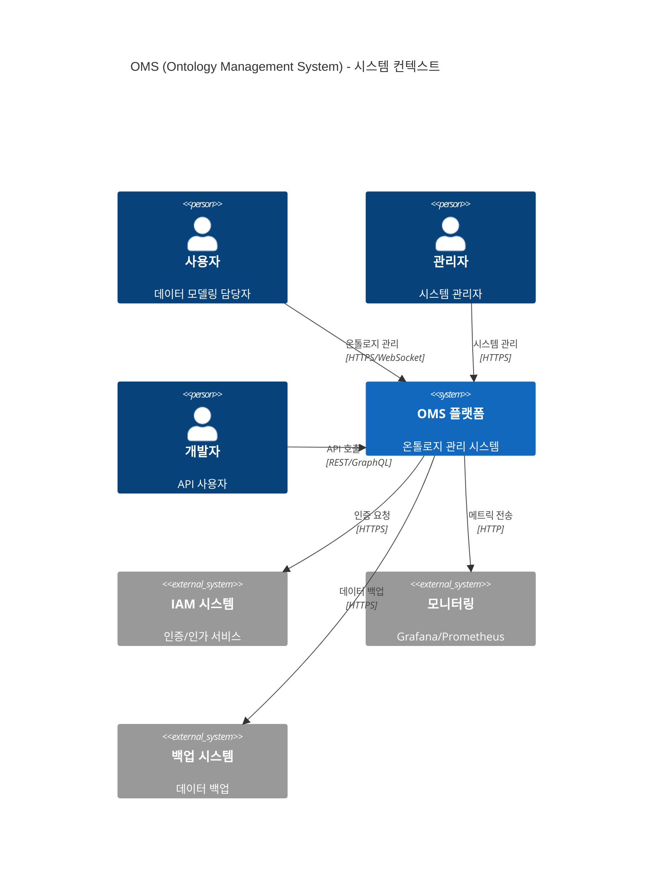
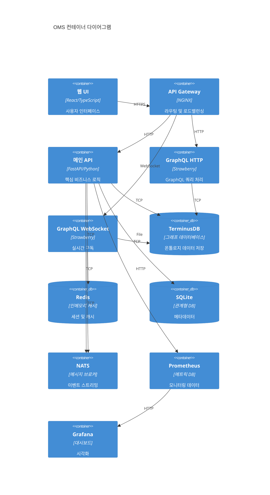
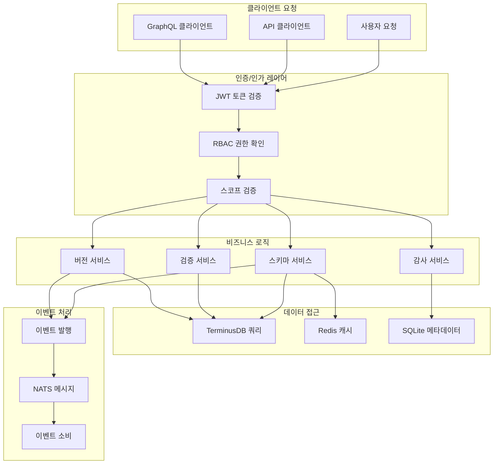
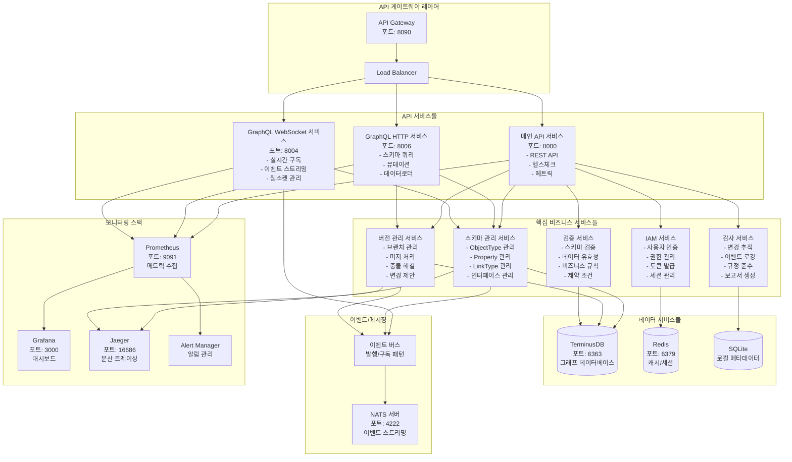
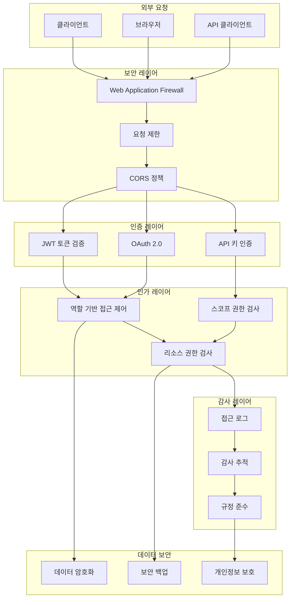
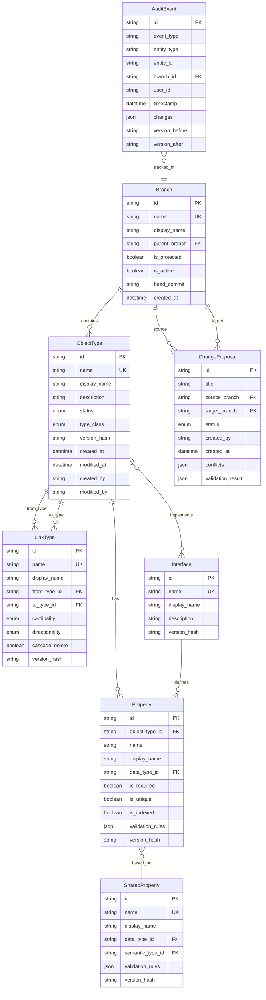
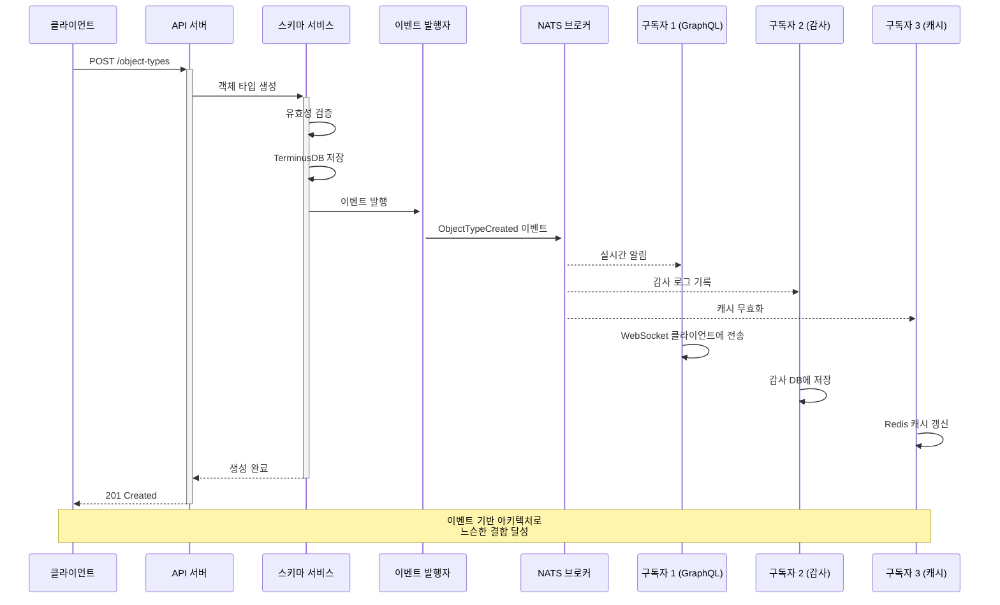
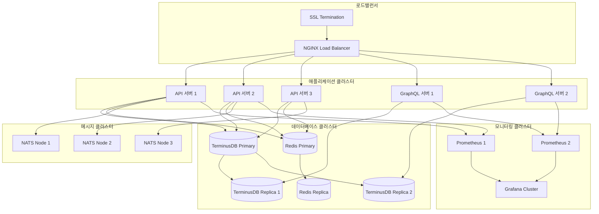
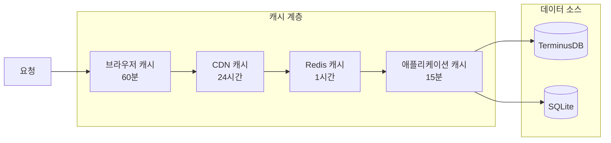
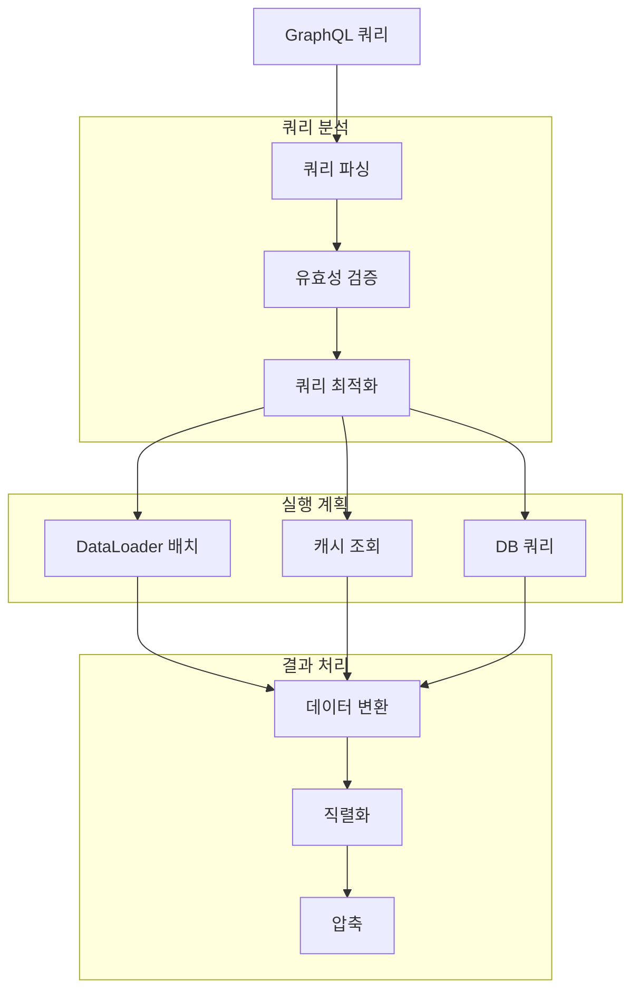

# 🏛️ OMS 시스템 아키텍처 상세 문서

## 📊 전체 시스템 아키텍처

## 🔧 컨테이너 아키텍처

## 🔄 데이터 플로우

## 🏗️ 마이크로서비스 분해도

## 🔒 보안 아키텍처

## 📊 데이터 모델 아키텍처

## 🔄 이벤트 아키텍처

## 🏗️ 배포 아키텍처

## 📈 성능 최적화 전략

### 1. 캐싱 전략

### 2. 쿼리 최적화

이 아키텍처 문서는 OMS 시스템의 전체적인 구조와 각 컴포넌트 간의 관계를 상세히 설명합니다. 각 다이어그램은 시스템의 다른 측면을 보여주며, 개발자와 운영자가 시스템을 이해하고 확장하는 데 도움이 됩니다.