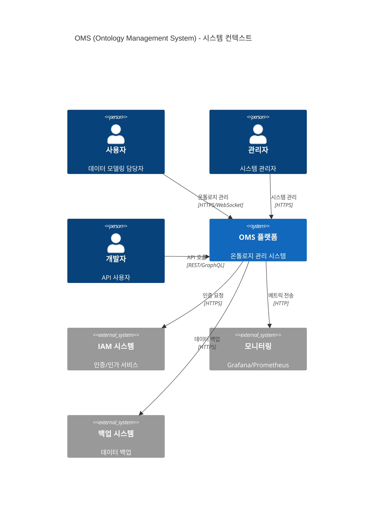
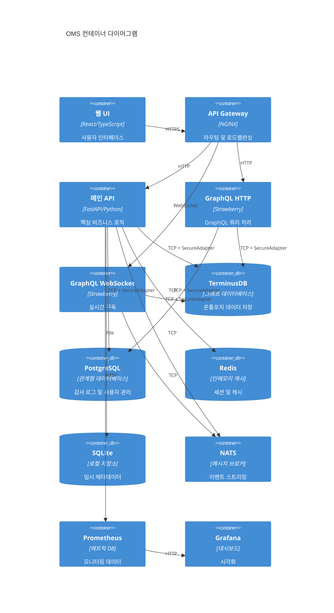
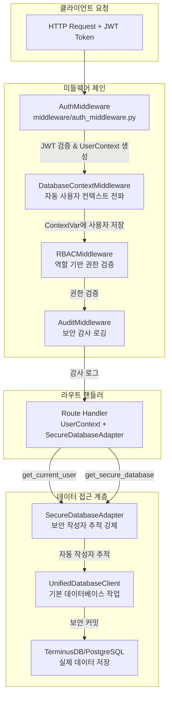
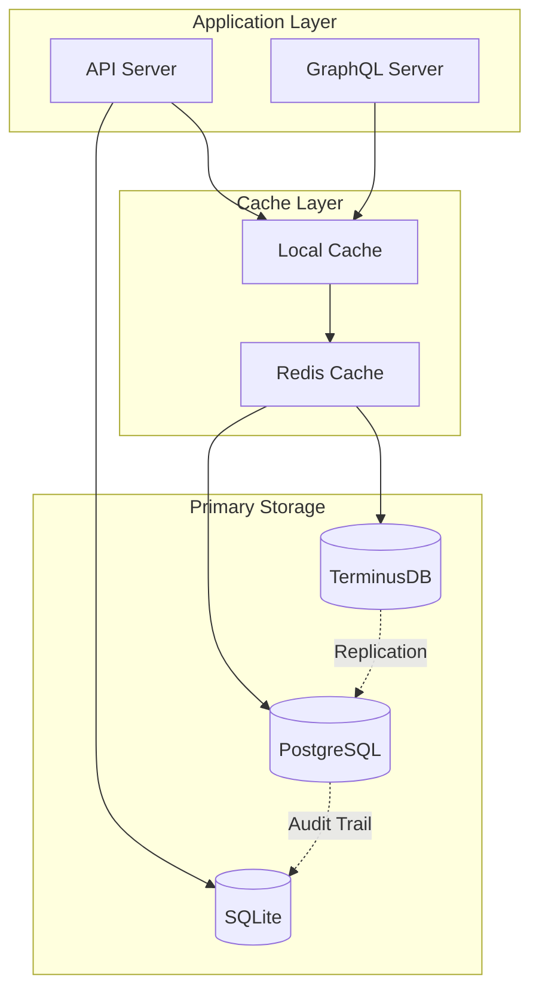
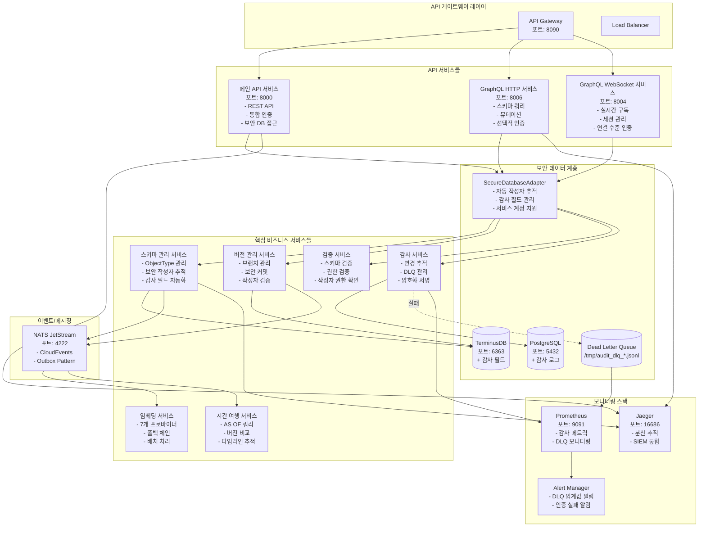

# 🏛️ OMS 시스템 아키텍처 상세 문서

## 📋 목차
1. [전체 시스템 아키텍처](#전체-시스템-아키텍처)
2. [컨테이너 아키텍처](#컨테이너-아키텍처)
3. [인증 및 보안 아키텍처](#인증-및-보안-아키텍처)
4. [TerminusDB 확장 기능](#terminusdb-확장-기능)
5. [하이브리드 데이터베이스 전략](#하이브리드-데이터베이스-전략)
6. [마이크로서비스 아키텍처](#마이크로서비스-아키텍처)
7. [성능 최적화](#성능-최적화)
8. [모니터링 및 관찰성](#모니터링-및-관찰성)
9. [배포 아키텍처](#배포-아키텍처)

## 📊 전체 시스템 아키텍처

OMS(Ontology Management System)는 TerminusDB를 중심으로 한 온톨로지 관리 플랫폼에서 엔터프라이즈급 확장 기능을 갖춘 종합 데이터 관리 시스템으로 진화했습니다.



## 🔧 컨테이너 아키텍처



## 🔐 인증 및 보안 아키텍처

### 통합 인증 미들웨어 체인



### 보안 데이터베이스 작업 패턴

```python
# ✅ 올바른 패턴 - 자동 작성자 추적
from middleware.auth_middleware import get_current_user
from database.dependencies import get_secure_database

@router.post("/items")
async def create_item(
    item: ItemCreate,
    user: UserContext = Depends(get_current_user),
    db: SecureDatabaseAdapter = Depends(get_secure_database)
):
    # 작성자 정보가 자동으로 추가됨
    result = await db.create(
        user_context=user,
        collection="items",
        document=item.dict(),
        message="Creating new item"
    )
    # 결과에는 _created_by, _created_at 등이 포함됨
    return result
```

### 보안 작성자 문자열 형식

```
# 일반 사용자
alice.smith (alice123)|verified|ts:2025-01-04T10:00:00Z|sig:abc123...

# 서비스 계정
deployment-service (svc_deploy) [service]|verified|ts:2025-01-04T10:00:00Z|sig:def456...

# 위임된 작업
etl-service (svc_etl) [service] [delegated|on_behalf_of:john.doe|reason:scheduled import]|ts:2025-01-04T10:00:00Z
```

## 🚀 TerminusDB 확장 기능

### 1. Vector Embeddings (벡터 임베딩)

**구현 위치**: `/core/embeddings/`

#### 지원 프로바이더
- **OpenAI**: GPT 모델 기반 임베딩 (tiktoken 통합)
- **Cohere**: 다국어 임베딩 특화
- **HuggingFace**: 오픈소스 모델 지원
- **Azure OpenAI**: 엔터프라이즈 보안
- **Google Vertex AI**: GCP 네이티브 통합
- **Anthropic Claude**: Claude + Sentence Transformers
- **Local**: 오프라인 작업용 로컬 모델

#### 주요 기능
```python
# 프로바이더 체인 설정
embedding_service = EmbeddingService(
    providers=[
        EmbeddingProvider.OPENAI,
        EmbeddingProvider.ANTHROPIC,  # 폴백
        EmbeddingProvider.LOCAL       # 최종 폴백
    ]
)

# 배치 처리 with 자동 분할
embeddings = await embedding_service.embed_batch(
    texts=documents,
    batch_size=100,
    show_progress=True
)
```

### 2. GraphQL Deep Linking

**구현 위치**: `/api/graphql/deep_linking.py`, `/core/graph/`

#### 아키텍처
```
┌─────────────────┐
│  GraphQL Client │
└────────┬────────┘
         │
┌────────▼────────┐
│  Resolver Layer │
└────────┬────────┘
         │
┌────────▼────────┐
│  Service Layer  │
└────────┬────────┘
         │
┌────────▼────────┐
│ Repository Layer│
└────────┬────────┘
         │
┌────────▼────────┐
│   TerminusDB    │
└─────────────────┘
```

### 3. Redis SmartCache

**구현 위치**: `/shared/cache/smart_cache.py`

#### 3-Tier 캐싱 구조
```python
# Tier 1: Local Memory (TTLCache)
local_cache = TTLCache(maxsize=1000, ttl=60)

# Tier 2: Redis (분산 캐시)
redis_cache = Redis(
    host="localhost",
    decode_responses=True,
    connection_pool=pool
)

# Tier 3: TerminusDB (영구 저장소)
terminus_cache = TerminusDBCache()
```

### 4. Time Travel Queries

**구현 위치**: `/core/time_travel/`

#### 지원 연산자
```sql
-- AS OF: 특정 시점의 상태
SELECT * FROM users AS OF '2024-01-01T00:00:00Z'

-- BETWEEN: 시간 범위 내 모든 버전
SELECT * FROM users BETWEEN '2024-01-01' AND '2024-12-31'

-- ALL_VERSIONS: 전체 이력
SELECT * FROM users ALL_VERSIONS
```

### 5. Delta Encoding

**구현 위치**: `/core/versioning/delta_compression.py`

#### 압축 전략
1. **JSON Patch**: 작은 변경사항
2. **Compressed Patch**: 중간 크기 변경
3. **Binary Diff**: 대용량 변경
4. **Chain Optimization**: 다중 버전 점프

성능: 평균 70% 저장 공간 절약

### 6. @unfoldable Documents

**구현 위치**: `/core/documents/unfoldable.py`

```python
# 대용량 문서 처리
doc = UnfoldableDocument(large_document)

# 압축된 뷰
folded = doc.fold(UnfoldContext(
    level=UnfoldLevel.COLLAPSED,
    include_summaries=True
))

# 특정 경로만 펼치기
content = doc.unfold_path("/sections/1/data")
```

### 7. @metadata Frames

**구현 위치**: `/core/documents/metadata_frames.py`

Markdown 문서에 구조화된 메타데이터를 포함하는 기능

### 8. Jaeger Tracing

**구현 위치**: `/infra/tracing/jaeger_adapter.py`

OpenTelemetry 통합으로 분산 추적 및 SIEM 연동

## 🗄️ 하이브리드 데이터베이스 전략

### 데이터베이스 역할 분담

| 데이터베이스 | 주요 역할 | 데이터 유형 | 보안 기능 |
|-------------|-----------|-------------|-----------|
| **TerminusDB** | 비즈니스 로직 | 온톨로지, 스키마, 관계 | 감사 필드, 커밋 작성자 |
| **PostgreSQL** | 운영 메타데이터 | 감사 로그, 사용자, 정책 | 불변 감사 추적 |
| **Redis** | 고성능 캐시 | 세션, 캐시, 분산락 | 토큰 캐싱 |
| **SQLite** | 로컬 저장소 | 버전 추적, 메타데이터 | 로컬 감사 |

### 데이터 플로우



### 감사 필드 스키마

```json
{
  "_created_by": "사용자 ID",
  "_created_by_username": "사용자명",
  "_created_at": "ISO 타임스탬프",
  "_updated_by": "마지막 수정자 ID",
  "_updated_by_username": "마지막 수정자명",
  "_updated_at": "마지막 수정 시간",
  "_deleted": false,
  "_deleted_by": "삭제자 ID (소프트 삭제 시)",
  "_deleted_by_username": "삭제자명",
  "_deleted_at": "삭제 시간"
}
```

## 🏗️ 마이크로서비스 아키텍처

### Palantir Foundry 스타일 MSA 설계

OMS는 Palantir Foundry의 다음 원칙들을 따릅니다:
- **Asset-First**: 데이터 자산 중심 설계
- **Strong Ontology**: 강력한 온톨로지 기반
- **Immutable Log**: 변경 불가능한 로그 기반

### 마이그레이션 로드맵

#### STEP 1: Data-Kernel Gateway 구현 ✅
- TerminusDB 접근을 위한 중앙 게이트웨이 구축
- REST 및 gRPC 이중 인터페이스
- 인증 미들웨어, 컨텍스트 주입, 트레이싱

#### STEP 2: gRPC Stub 마이그레이션 ✅
- Proto 파일 정의 및 서비스 구현
- FastAPI와 함께 gRPC 서버 실행
- TerminusGatewayClient를 통한 원활한 마이그레이션

#### STEP 3: Branch/Author 컨텍스트 관리 ✅
- 브랜치 명명 규칙: `<env>/<service>/<purpose>`
- 작성자 형식: `<user>@<service>`
- TerminusContextMiddleware를 통한 자동 메타데이터 주입

#### STEP 4: Commit Hook Pipeline ✅
- 포괄적인 검증 및 이벤트 파이프라인
- Validators: Rule, Tamper, Schema, PII
- Event Sinks: NATS, Audit, Webhook, Metrics
- 롤백 지원과 함께 TerminusService 통합

#### STEP 5: 마이크로서비스 추출 ✅
- Vector-Embedding 서비스 분리
- Advanced-Scheduler 서비스 분리
- Event-Gateway 서비스 분리
- Docker Compose를 통한 오케스트레이션

### 서비스 분해도



## 📈 성능 최적화

### 1. 쿼리 최적화
- **배치 처리**: N+1 문제 해결
- **인덱스 전략**: 복합 인덱스 활용
- **쿼리 캐싱**: 결과 재사용
- **병렬 처리**: Thread/Process pools

### 2. 메모리 최적화
- **스트리밍**: 대용량 데이터 처리
- **압축**: zlib/gzip 활용
- **지연 로딩**: @unfoldable 활용
- **가비지 컬렉션**: 메모리 누수 방지

### 3. 캐싱 전략
- **인증 캐싱**: JWT 토큰 검증 결과 5분 캐싱
- **3-Tier 캐싱**: Local → Redis → DB
- **캐시 무효화**: 이벤트 기반 갱신
- **캐시 예열**: 자주 사용되는 데이터 사전 로드

### 4. 데이터베이스 연결 풀링
- TerminusDB: 최대 20 연결
- PostgreSQL: 최대 50 연결
- Redis: 연결 풀 100
- 연결 재사용으로 오버헤드 감소

### 5. 비동기 처리
- **백그라운드 태스크**: 감사 로그, 임베딩 생성
- **이벤트 기반 처리**: NATS를 통한 비동기 통신
- **DLQ 처리**: 실패한 작업 재시도
- **스트림 처리**: 대용량 데이터 실시간 처리

## 📊 모니터링 및 관찰성

### Prometheus 메트릭
```yaml
# 애플리케이션 메트릭
- request_duration_seconds
- request_count_total
- active_connections

# 캐시 메트릭
- cache_hit_ratio
- cache_eviction_total
- cache_size_bytes

# 임베딩 메트릭
- embedding_provider_latency
- embedding_batch_size
- embedding_errors_total

# 시간 여행 메트릭
- time_travel_query_duration
- time_travel_cache_hits
- version_comparison_count

# 보안 메트릭
- authentication_attempts_total
- authorization_failures_total
- secure_author_verifications_total

# DLQ 메트릭
- audit_dlq_size
- audit_dlq_oldest_event_age_seconds
- audit_event_failures_total
```

### 분산 추적 (Jaeger)
```
┌─────────┐     ┌─────────┐     ┌─────────┐     ┌─────────┐
│ Client  │────▶│   API   │────▶│ Service │────▶│   DB    │
└─────────┘     └─────────┘     └─────────┘     └─────────┘
     │               │               │               │
     └───────────────┴───────────────┴───────────────┘
                    Jaeger Trace Span
```

### 대시보드 구성

1. **시스템 개요**
   - 요청률 및 응답 시간
   - 에러율 및 성공률
   - 활성 사용자 수

2. **성능 메트릭**
   - API 엔드포인트별 레이턴시
   - 데이터베이스 쿼리 성능
   - 캐시 효율성

3. **보안 대시보드**
   - 인증 시도 및 실패
   - 비정상 접근 패턴
   - DLQ 상태 모니터링

4. **비즈니스 메트릭**
   - 온톨로지 생성/수정 통계
   - 사용자 활동 패턴
   - 리소스 사용량

## 🚀 배포 아키텍처

### 배포 옵션

#### 1. 모놀리스 모드 (기본)
```bash
docker-compose up
```
모든 서비스가 단일 컨테이너 내에서 실행됩니다.

#### 2. 마이크로서비스 모드
```bash
# 기본 인프라 시작
docker-compose up -d

# 마이크로서비스 시작
docker-compose -f docker-compose.microservices.yml up -d
```

#### 3. 하이브리드 모드
환경 변수를 통해 특정 서비스만 활성화:
```bash
export USE_EMBEDDING_MS=true
export USE_SCHEDULER_MS=false
export USE_EVENT_GATEWAY=false
docker-compose up
```

### 환경 변수 설정

#### Data-Kernel Gateway
- `USE_DATA_KERNEL_GATEWAY`: 게이트웨이 모드 활성화 (기본: false)
- `DATA_KERNEL_GRPC_ENDPOINT`: 게이트웨이 gRPC 엔드포인트

#### 마이크로서비스
- `USE_EMBEDDING_MS`: 임베딩 마이크로서비스 사용
- `EMBEDDING_SERVICE_ENDPOINT`: 임베딩 서비스 gRPC 엔드포인트
- `USE_SCHEDULER_MS`: 스케줄러 마이크로서비스 사용
- `SCHEDULER_SERVICE_ENDPOINT`: 스케줄러 서비스 gRPC 엔드포인트
- `USE_EVENT_GATEWAY`: 이벤트 게이트웨이 마이크로서비스 사용
- `EVENT_GATEWAY_ENDPOINT`: 이벤트 게이트웨이 gRPC 엔드포인트

### 마이그레이션 전략

#### 단계 1: Data-Kernel Gateway
1. Data-Kernel Gateway 배포
2. `USE_DATA_KERNEL_GATEWAY=true` 설정
3. 모든 TerminusDB 작업이 게이트웨이를 통해 작동하는지 확인

#### 단계 2: Embedding Service
1. embedding-service 컨테이너 배포
2. `USE_EMBEDDING_MS=true` 설정
3. 콜드 스타트 시간 및 응답 대기 시간 모니터링
4. GPU/CPU 사용량 기반 스케일링

#### 단계 3: Scheduler Service
1. scheduler-service 및 워커 배포
2. `USE_SCHEDULER_MS=true` 설정
3. 작업 실행 및 영속성 확인
4. 워커 독립적 스케일링

#### 단계 4: Event Gateway
1. event-gateway 컨테이너 배포
2. `USE_EVENT_GATEWAY=true` 설정
3. 이벤트 흐름 및 웹훅 전달 확인
4. NATS 성능 모니터링

#### 단계 5: 정리
1. 모놀리스에서 사용하지 않는 모듈 제거
2. 모놀리스 이미지 크기 최적화
3. CI/CD 파이프라인 업데이트

### 프로덕션 환경 구성

```yaml
# docker-compose.production.yml
services:
  oms-api:
    image: oms/api:latest
    environment:
      - AUTH_MODE=iam_service
      - TERMINUS_DB_URL=https://terminus-prod.company.com
      - IAM_SERVICE_URL=https://iam.company.com
      - ENABLE_AUDIT_DLQ=true
      - DLQ_ALERT_THRESHOLD=100
      # 확장 기능 활성화
      - ENABLE_EMBEDDINGS=true
      - ENABLE_TIME_TRAVEL=true
      - ENABLE_SMART_CACHE=true
      - ENABLE_JAEGER_TRACING=true
      # 프로바이더 설정
      - EMBEDDING_PROVIDERS=openai,anthropic,local
      - OPENAI_API_KEY=${OPENAI_API_KEY}
      - ANTHROPIC_API_KEY=${ANTHROPIC_API_KEY}
    deploy:
      replicas: 3
      resources:
        limits:
          cpus: '2'
          memory: 4G
        reservations:
          cpus: '1'
          memory: 2G
      
  prometheus:
    image: prom/prometheus:latest
    configs:
      - source: audit_alerts
        target: /etc/prometheus/alerts/audit.yml
    volumes:
      - prometheus_data:/prometheus
      
  jaeger:
    image: jaegertracing/all-in-one:latest
    environment:
      - COLLECTOR_OTLP_ENABLED=true
    ports:
      - "16686:16686"
      - "4317:4317"
      
  redis:
    image: redis:7-alpine
    command: redis-server --maxmemory 2gb --maxmemory-policy allkeys-lru
    volumes:
      - redis_data:/data
```

### 확장성 전략

1. **수평적 확장**
   - API 서버 레플리카 자동 스케일링
   - 로드 밸런서를 통한 트래픽 분산
   - 데이터베이스 읽기 전용 레플리카

2. **수직적 확장**
   - 리소스 요구사항에 따른 동적 할당
   - 메모리 집약적 작업용 전용 노드
   - GPU 가속 (임베딩 생성)

3. **지역별 배포**
   - 멀티 리전 지원
   - 지연 시간 최소화
   - 재해 복구 계획

### 모니터링 및 운영

#### 헬스 체크
모든 서비스는 헬스 엔드포인트를 노출합니다:
- Data-Kernel: `http://localhost:8080/health`
- Embedding: `http://localhost:8001/health`
- Scheduler: `http://localhost:8002/health`
- Event Gateway: `http://localhost:8003/health`

#### 메트릭
각 서비스에서 `/metrics`로 Prometheus 메트릭 이용 가능

#### 트레이싱
OpenTelemetry 트레이스가 모든 서비스를 통해 흐릅니다:
```
Client → OMS → Gateway → TerminusDB
         ↓
    Microservice
```

#### 로깅
트레이스 상관 관계가 있는 구조화된 JSON 로그

## 🔮 미래 로드맵

### 단기 (3-6개월)
- [ ] 서비스 메시 (Istio/Linkerd) 도입
- [ ] 외부 접근을 위한 API Gateway (Kong/Traefik)
- [ ] 고용량 이벤트를 위한 메시지 스트리밍 (Kafka)
- [ ] AI 기반 스키마 추천

### 중기 (6-12개월)
- [ ] 공유 캐시를 위한 Redis Cluster
- [ ] 모델 관리를 위한 ML Platform (Kubeflow)
- [ ] 자동 스케일링 고도화
- [ ] 고급 분석 도구

### 장기 (12개월+)
- [ ] 블록체인 통합 (불변 감사)
- [ ] 양자 내성 암호화
- [ ] 자율 시스템 관리
- [ ] 글로벌 분산 아키텍처

## 📚 참고 문서

- [인증 마이그레이션 가이드](/docs/AUTHENTICATION_MIGRATION.md)
- [서비스 계정 정책](/docs/SERVICE_ACCOUNT_POLICY.md)
- [프로덕션 배포 가이드](/migrations/PRODUCTION_DEPLOYMENT_README.md)
- [API 문서](/docs/api/)
- [문서 인덱스](/docs/INDEX.md)

---

*이 문서는 지속적으로 업데이트되며, 시스템의 진화와 함께 발전합니다.*