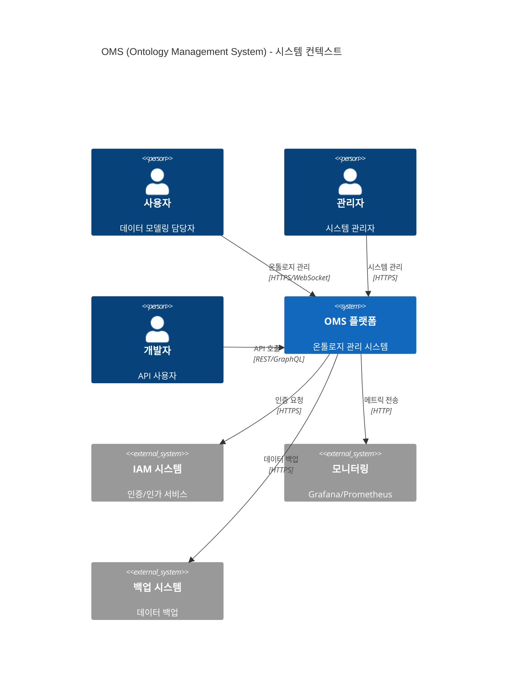
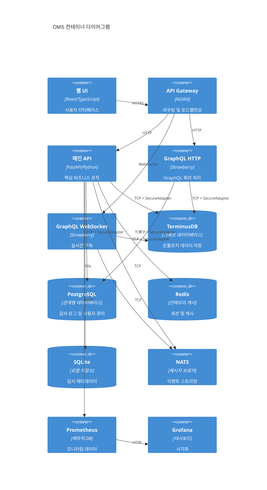
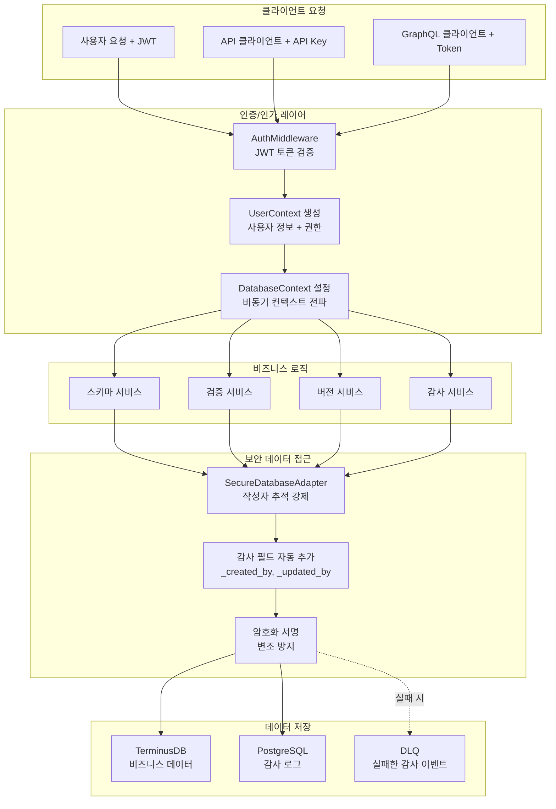
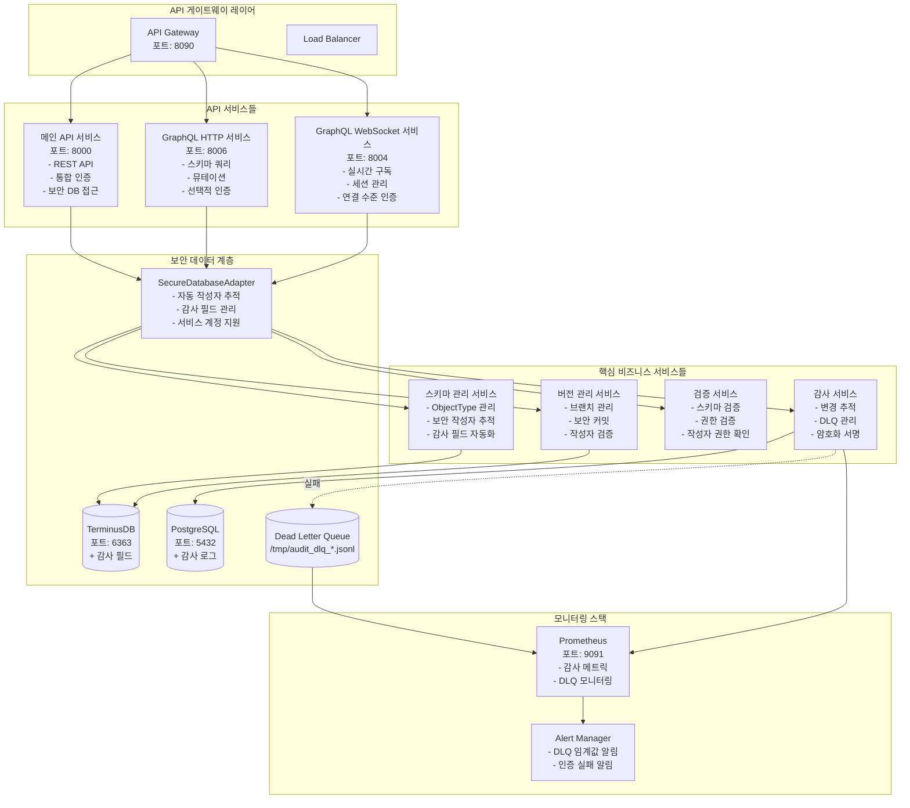

# 🏛️ OMS 시스템 아키텍처 상세 문서

## 📊 전체 시스템 아키텍처



## 🔧 컨테이너 아키텍처



## 🔐 인증 및 보안 아키텍처 (업데이트됨)

### 통합 인증 미들웨어 체인

```mermaid
flowchart TD
    subgraph "클라이언트 요청"
        A[HTTP Request + JWT Token]
    end

    subgraph "미들웨어 체인"
        B[AuthMiddleware<br/>middleware/auth_middleware.py]
        C[DatabaseContextMiddleware<br/>자동 사용자 컨텍스트 전파]
        D[RBACMiddleware<br/>역할 기반 권한 검증]
        E[AuditMiddleware<br/>보안 감사 로깅]
    end

    subgraph "라우트 핸들러"
        F[Route Handler<br/>UserContext + SecureDatabaseAdapter]
    end

    subgraph "데이터 접근 계층"
        G[SecureDatabaseAdapter<br/>보안 작성자 추적 강제]
        H[UnifiedDatabaseClient<br/>기본 데이터베이스 작업]
        I[TerminusDB/PostgreSQL<br/>실제 데이터 저장]
    end

    A --> B
    B -->|JWT 검증 & UserContext 생성| C
    C -->|ContextVar에 사용자 저장| D
    D -->|권한 검증| E
    E -->|감사 로그| F
    F -->|Depends(get_current_user)| G
    F -->|Depends(get_secure_database)| G
    G -->|자동 작성자 추적| H
    H -->|보안 커밋| I
```

### 보안 데이터베이스 작업 패턴

```python
# ✅ 올바른 패턴 - 자동 작성자 추적
from middleware.auth_middleware import get_current_user
from database.dependencies import get_secure_database

@router.post("/items")
async def create_item(
    item: ItemCreate,
    user: UserContext = Depends(get_current_user),
    db: SecureDatabaseAdapter = Depends(get_secure_database)
):
    # 작성자 정보가 자동으로 추가됨
    result = await db.create(
        user_context=user,
        collection="items",
        document=item.dict(),
        message="Creating new item"
    )
    # 결과에는 _created_by, _created_at 등이 포함됨
    return result

# ❌ 잘못된 패턴 - 사용 금지
from database.clients.unified_database_client import get_unified_database_client

async def bad_pattern():
    db = await get_unified_database_client()
    # 작성자 추적 없음!
    await db.create(...)
```

### 보안 작성자 문자열 형식

```
# 일반 사용자
alice.smith (alice123)|verified|ts:2025-01-04T10:00:00Z|sig:abc123...

# 서비스 계정
deployment-service (svc_deploy) [service]|verified|ts:2025-01-04T10:00:00Z|sig:def456...

# 위임된 작업
etl-service (svc_etl) [service] [delegated|on_behalf_of:john.doe|reason:scheduled import]|ts:2025-01-04T10:00:00Z
```

## 🔄 데이터 플로우 (보안 강화)



## 🏗️ 마이크로서비스 분해도



## 🔒 보안 아키텍처 개선사항

### 1. 통합 인증 소스
- **단일 진입점**: `middleware.auth_middleware.get_current_user`
- **일관된 UserContext**: 모든 엔드포인트에서 동일한 사용자 정보
- **자동 전파**: DatabaseContextMiddleware를 통한 비동기 컨텍스트 전파

### 2. 강제 작성자 추적
- **SecureDatabaseAdapter**: 모든 쓰기 작업에 작성자 정보 필수
- **감사 필드**: _created_by, _updated_by, _deleted_by 자동 추가
- **암호화 서명**: 작성자 정보 변조 방지

### 3. 서비스 계정 관리
```python
# 서비스 계정 식별
if user_context.user_id.startswith("svc_"):
    # 서비스 계정 특별 처리
    author_string = f"{username} ({user_id}) [service]"
```

### 4. DLQ (Dead Letter Queue) 모니터링
```yaml
# Prometheus 메트릭
oms_audit_dlq_size{dlq_type="fallback"}: 현재 DLQ 크기
oms_audit_dlq_oldest_event_age_seconds: 가장 오래된 이벤트 나이
oms_secure_author_verifications_total: 작성자 검증 횟수
```

## 🗄️ 하이브리드 데이터베이스 전략

### 데이터베이스 역할 분담

| 데이터베이스 | 주요 역할 | 데이터 유형 | 보안 기능 |
|-------------|-----------|-------------|-----------|
| **TerminusDB** | 비즈니스 로직 | 온톨로지, 스키마, 관계 | 감사 필드, 커밋 작성자 |
| **PostgreSQL** | 운영 메타데이터 | 감사 로그, 사용자, 정책 | 불변 감사 추적 |
| **Redis** | 고성능 캐시 | 세션, 캐시, 분산락 | 토큰 캐싱 |
| **SQLite** | 로컬 저장소 | 버전 추적, 메타데이터 | 로컬 감사 |

### 감사 필드 스키마

```json
{
  "_created_by": "사용자 ID",
  "_created_by_username": "사용자명",
  "_created_at": "ISO 타임스탬프",
  "_updated_by": "마지막 수정자 ID",
  "_updated_by_username": "마지막 수정자명",
  "_updated_at": "마지막 수정 시간",
  "_deleted": false,
  "_deleted_by": "삭제자 ID (소프트 삭제 시)",
  "_deleted_by_username": "삭제자명",
  "_deleted_at": "삭제 시간"
}
```

## 📈 성능 최적화

### 1. 인증 캐싱
- JWT 토큰 검증 결과 5분 캐싱
- Redis 기반 분산 캐시
- 토큰 무효화 시 즉시 캐시 삭제

### 2. 데이터베이스 연결 풀링
- TerminusDB: 최대 20 연결
- PostgreSQL: 최대 50 연결
- 연결 재사용으로 오버헤드 감소

### 3. 비동기 감사 로깅
- 백그라운드 태스크로 감사 로그 처리
- DLQ로 실패 처리
- 메인 요청 흐름에 영향 없음

## 🚀 배포 아키텍처

### 프로덕션 환경 구성

```yaml
# docker-compose.production.yml
services:
  oms-api:
    environment:
      - AUTH_MODE=iam_service
      - TERMINUS_DB_URL=https://terminus-prod.company.com
      - IAM_SERVICE_URL=https://iam.company.com
      - ENABLE_AUDIT_DLQ=true
      - DLQ_ALERT_THRESHOLD=100
    deploy:
      replicas: 3
      
  prometheus:
    configs:
      - source: audit_alerts
        target: /etc/prometheus/alerts/audit.yml
```

### 모니터링 대시보드

1. **인증 메트릭**
   - 인증 성공/실패율
   - 토큰 캐시 히트율
   - 서비스 계정 사용 현황

2. **감사 메트릭**
   - 작성자 검증 성공률
   - DLQ 크기 및 나이
   - 감사 이벤트 처리 시간

3. **보안 알림**
   - DLQ 임계값 초과
   - 비정상적인 서비스 계정 활동
   - 반복된 인증 실패

## 📚 참고 문서

- [인증 마이그레이션 가이드](/docs/AUTHENTICATION_MIGRATION.md)
- [서비스 계정 정책](/docs/SERVICE_ACCOUNT_POLICY.md)
- [프로덕션 배포 가이드](/migrations/PRODUCTION_DEPLOYMENT_README.md)
- [보안 모범 사례](/docs/SECURITY_BEST_PRACTICES.md)