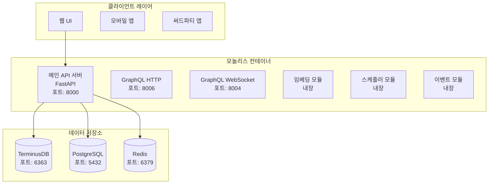
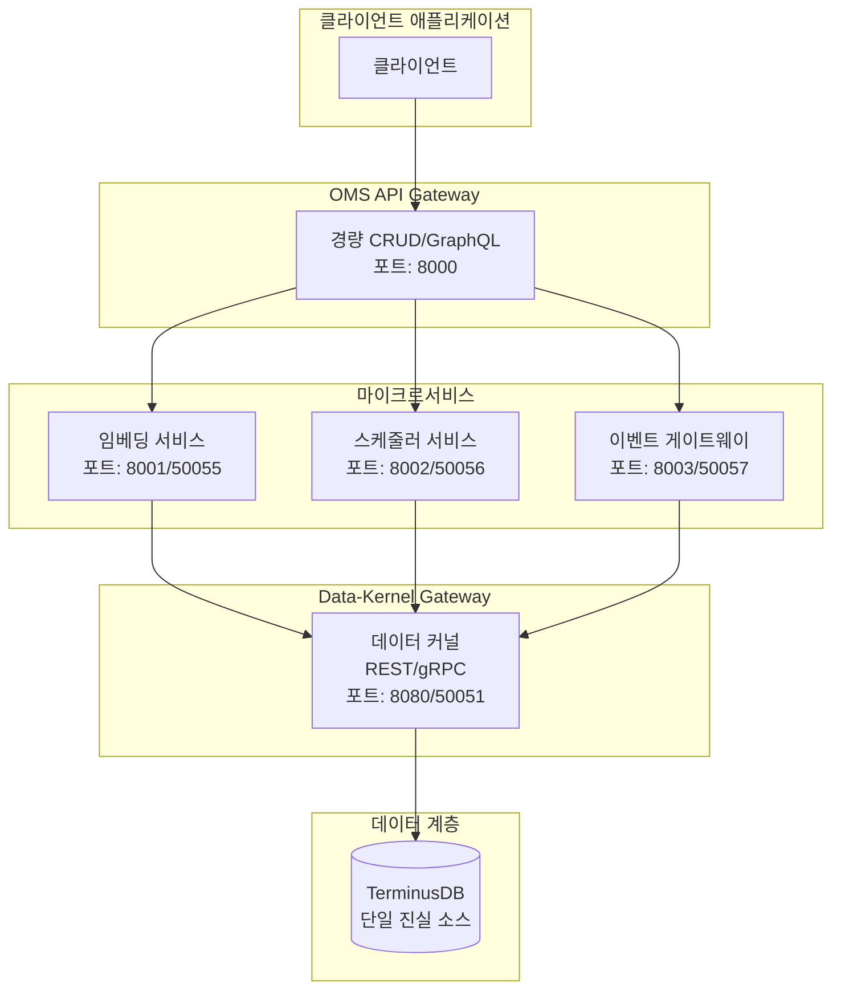

# 🚀 OMS (Ontology Management System) - 온톨로지 관리 시스템

> **엔터프라이즈급 온톨로지 관리 및 데이터 모델링 플랫폼**

## 📋 개요

OMS는 복잡한 데이터 모델과 온톨로지를 체계적으로 관리하기 위한 현대적인 엔터프라이즈 솔루션입니다. 그래프 데이터베이스, 실시간 API, 그리고 고급 보안 기능을 통합하여 대규모 조직의 데이터 구조를 효율적으로 관리할 수 있습니다.

## ✨ 주요 기능

### 🏗️ 온톨로지 관리
- **객체 타입(ObjectType)** 정의 및 관리
- **속성(Property)** 시스템 및 데이터 타입 지원
- **링크 타입(LinkType)** 관계 모델링
- **인터페이스(Interface)** 및 공유 속성 지원

### 🔄 버전 관리
- **Git 스타일 브랜치** 시스템
- **변경 제안(Change Proposal)** 워크플로우
- **머지 및 충돌 해결** 기능
- **감사 추적(Audit Trail)** 완전 지원

### 🌐 API 인터페이스
- **REST API** - 완전한 CRUD 작업
- **GraphQL API** - 실시간 쿼리 및 구독
- **WebSocket** - 실시간 이벤트 스트리밍
- **OpenAPI 문서** - 자동 생성된 API 문서

### 🔐 보안 및 인증 (강화됨)
- **통합 JWT 기반 인증** - 단일 인증 소스
- **RBAC (Role-Based Access Control)** - 세밀한 권한 관리
- **보안 작성자 추적** - 모든 데이터 변경에 암호화 서명된 작성자 정보
- **서비스 계정 관리** - 자동화 및 통합을 위한 특별 계정
- **감사 필드 자동화** - _created_by, _updated_by 자동 추가

### 📊 모니터링 및 관찰성
- **Prometheus** 메트릭 수집 + 감사 메트릭
- **Grafana** 대시보드 + DLQ 모니터링
- **Jaeger** 분산 트레이싱 (OpenTelemetry 통합)
- **실시간 헬스 체크** + 보안 알림

### 🚀 고급 기능 (TerminusDB 확장)
- **Vector Embeddings** - 7개 프로바이더 지원 (OpenAI, Cohere, HuggingFace, Azure, Google Vertex, Anthropic, Local)
- **GraphQL Deep Linking** - Repository/Service/Resolver 아키텍처
- **Redis SmartCache** - 3-tier 캐싱 (Local → Redis → TerminusDB)
- **Time Travel Queries** - AS OF, BETWEEN, ALL_VERSIONS 연산자
- **Delta Encoding** - 압축 전략을 통한 스토리지 효율성
- **@unfoldable Documents** - 선택적 콘텐츠 로딩
- **@metadata Frames** - Markdown 문서 메타데이터

## 🏛️ 시스템 아키텍처

### 배포 모드

OMS는 세 가지 배포 모드를 지원합니다:

#### 1. 모놀리스 모드 (기본)
모든 서비스가 단일 컨테이너에서 실행되는 전통적인 배포 방식입니다.



#### 2. 마이크로서비스 모드
Palantir Foundry 스타일의 MSA 설계를 따르는 분산 아키텍처입니다.



#### 3. 하이브리드 모드
점진적 마이그레이션을 위해 특정 서비스만 분리하여 운영할 수 있습니다.

### 마이크로서비스 상세

#### Data-Kernel Gateway
- **목적**: 모든 TerminusDB 작업을 위한 중앙 집중식 접근점
- **기능**:
  - 연결 풀링 및 최적화
  - 브랜치/작성자 컨텍스트 관리
  - 검증 및 이벤트를 위한 커밋 훅
  - REST 및 gRPC 인터페이스 제공
- **위치**: `/data_kernel`

#### Vector-Embedding Service
- **목적**: ML 모델 작업 및 벡터 임베딩 처리
- **기능**:
  - 다중 프로바이더 지원 (OpenAI, Hugging Face 등)
  - 캐싱 및 배치 처리
  - 모델 버전 관리
  - 유사도 검색
- **포트**: 8001 (REST), 50055 (gRPC)

#### Advanced-Scheduler Service
- **목적**: 백그라운드 작업 및 예약된 작업 처리
- **기능**:
  - TerminusDB에 작업 영속성
  - 워커를 통한 분산 실행
  - Cron 및 간격 스케줄링
  - 작업 상태 추적
- **포트**: 8002 (REST), 50056 (gRPC)

#### Event-Gateway Service
- **목적**: 중앙 집중식 이벤트 분배
- **기능**:
  - NATS 통합
  - CloudEvents 형식
  - 웹훅 전달
  - 이벤트 영속성
- **포트**: 8003 (REST), 50057 (gRPC)

## 🚀 빠른 시작

### 필수 요구사항
- Python 3.9+
- Docker & Docker Compose
- Redis 6+
- TerminusDB 11+

### 설치 및 실행

```bash
# 저장소 클론
git clone https://github.com/your-org/oms-monolith.git
cd oms-monolith

# 의존성 설치
pip install -r requirements_updated.txt

# 환경 설정
cp .env.example .env
# .env 파일 편집하여 설정 추가

# Docker 서비스 시작

# 1. 모놀리스 모드 (기본)
docker-compose up -d

# 2. 마이크로서비스 모드
docker-compose up -d
docker-compose -f docker-compose.microservices.yml up -d

# 3. 하이브리드 모드 (특정 서비스만 활성화)
export USE_EMBEDDING_MS=true
export USE_SCHEDULER_MS=false
export USE_EVENT_GATEWAY=false
docker-compose up -d

# 마이그레이션 실행
python migrations/production_audit_fields_migration.py --env development --execute

# 애플리케이션 시작
python main.py
```

### API 문서
- REST API: http://localhost:8000/docs
- GraphQL Playground: http://localhost:8006/graphql
- WebSocket: ws://localhost:8004/graphql

## 🔐 인증 및 보안

### 통합 인증 사용법

```python
# ✅ 올바른 인증 패턴
from middleware.auth_middleware import get_current_user
from database.dependencies import get_secure_database
from database.clients.secure_database_adapter import SecureDatabaseAdapter

@router.post("/items")
async def create_item(
    item: ItemCreate,
    user: UserContext = Depends(get_current_user),
    db: SecureDatabaseAdapter = Depends(get_secure_database)
):
    # 자동으로 작성자 정보가 추가됨
    result = await db.create(
        user_context=user,
        collection="items",
        document=item.dict()
    )
    return result
```

### 감사 필드

모든 데이터베이스 쓰기 작업에 자동으로 추가되는 필드:
- `_created_by`: 작성자 ID
- `_created_by_username`: 작성자 이름
- `_created_at`: 생성 시간
- `_updated_by`: 수정자 ID
- `_updated_by_username`: 수정자 이름
- `_updated_at`: 수정 시간

### 서비스 계정

백그라운드 작업이나 자동화를 위한 서비스 계정:
```python
# 서비스 계정 식별 패턴
svc_deployment    # 배포 서비스
svc_etl          # ETL 파이프라인
svc_monitoring   # 모니터링 서비스
```

## 📊 모니터링

### Prometheus 메트릭
```
# 감사 이벤트
oms_audit_events_total{action="create",resource_type="ObjectType"}

# DLQ 모니터링
oms_audit_dlq_size{dlq_type="fallback"}
oms_audit_dlq_oldest_event_age_seconds

# 보안 검증
oms_secure_author_verifications_total{result="valid"}
```

### 헬스체크 엔드포인트
- 전체 헬스: `GET /api/v1/health`
- 세부 헬스: `GET /api/v1/health/detailed`
- 준비 상태: `GET /api/v1/ready`

## 🛠️ 개발 가이드

### 프로젝트 구조
```
oms-monolith/
├── api/                 # API 엔드포인트
│   ├── v1/             # REST API v1
│   └── graphql/        # GraphQL API
├── core/               # 핵심 비즈니스 로직
│   ├── auth/          # 인증/인가
│   ├── schema/        # 스키마 관리
│   └── audit/         # 감사 추적
├── middleware/         # 미들웨어 체인
├── database/          # 데이터베이스 클라이언트
│   └── clients/       # DB 어댑터
├── migrations/        # 스키마 마이그레이션
└── docs/             # 문서
```

### 코딩 표준
- Python 3.9+ 타입 힌트 사용
- Black 포매터 적용
- 100% 테스트 커버리지 목표
- 모든 쓰기 작업에 SecureDatabaseAdapter 사용

## 📚 문서

- [아키텍처 상세](/ARCHITECTURE.md)
- [인증 마이그레이션 가이드](/docs/AUTHENTICATION_MIGRATION.md)
- [서비스 계정 정책](/docs/SERVICE_ACCOUNT_POLICY.md)
- [프로덕션 배포 가이드](/migrations/PRODUCTION_DEPLOYMENT_README.md)
- [API 레퍼런스](/docs/api/)

## 🤝 기여하기

1. 이슈 생성 또는 기능 제안
2. 포크 및 브랜치 생성
3. 변경사항 커밋 (보안 가이드라인 준수)
4. 풀 리퀘스트 생성

## 📄 라이선스

이 프로젝트는 [MIT 라이선스](LICENSE)를 따릅니다.

## 🙏 감사의 말

- TerminusDB 팀 - 강력한 그래프 데이터베이스
- FastAPI 커뮤니티 - 현대적인 웹 프레임워크
- OpenTelemetry - 표준화된 관찰성

---

**문의사항**: oms-team@company.com | **이슈 트래커**: [GitHub Issues](https://github.com/your-org/oms-monolith/issues)