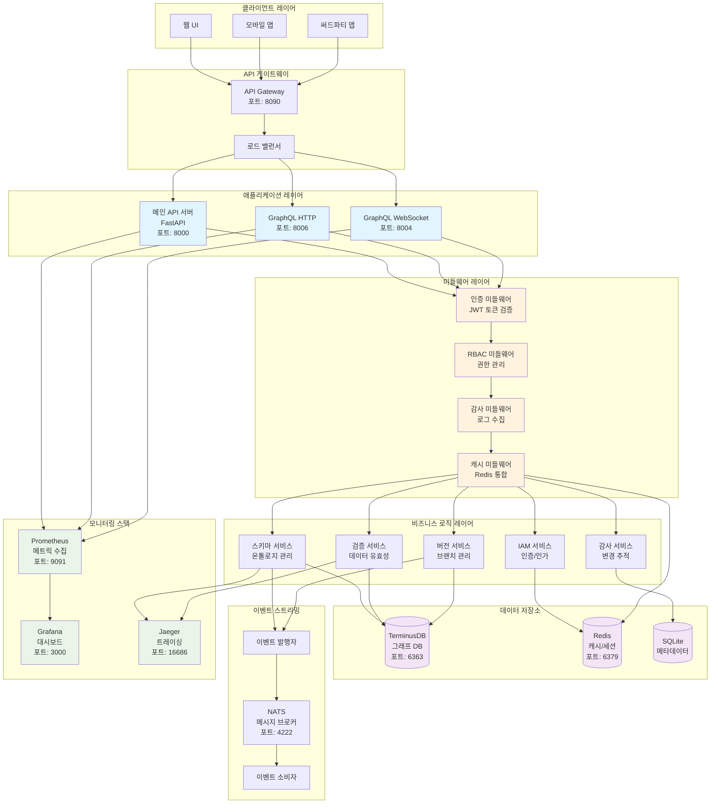

# 🚀 OMS (Ontology Management System) - 온톨로지 관리 시스템

> **엔터프라이즈급 온톨로지 관리 및 데이터 모델링 플랫폼**

## 📋 개요

OMS는 복잡한 데이터 모델과 온톨로지를 체계적으로 관리하기 위한 현대적인 엔터프라이즈 솔루션입니다. 그래프 데이터베이스, 실시간 API, 그리고 고급 보안 기능을 통합하여 대규모 조직의 데이터 구조를 효율적으로 관리할 수 있습니다.

## ✨ 주요 기능

### 🏗️ 온톨로지 관리
- **객체 타입(ObjectType)** 정의 및 관리
- **속성(Property)** 시스템 및 데이터 타입 지원
- **링크 타입(LinkType)** 관계 모델링
- **인터페이스(Interface)** 및 공유 속성 지원

### 🔄 버전 관리
- **Git 스타일 브랜치** 시스템
- **변경 제안(Change Proposal)** 워크플로우
- **머지 및 충돌 해결** 기능
- **감사 추적(Audit Trail)** 완전 지원

### 🌐 API 인터페이스
- **REST API** - 완전한 CRUD 작업
- **GraphQL API** - 실시간 쿼리 및 구독
- **WebSocket** - 실시간 이벤트 스트리밍
- **OpenAPI 문서** - 자동 생성된 API 문서

### 🔐 보안 및 인증
- **JWT 기반 인증** 시스템
- **RBAC (Role-Based Access Control)**
- **스코프 기반 권한 관리**
- **API 키 및 토큰 관리**

### 📊 모니터링 및 관찰성
- **Prometheus** 메트릭 수집
- **Grafana** 대시보드
- **Jaeger** 분산 트레이싱
- **실시간 헬스 체크**

## 🏛️ 시스템 아키텍처



## 🚀 빠른 시작

### 사전 요구사항
- Docker & Docker Compose
- Python 3.11+
- Node.js 18+ (프론트엔드 개발시)

### 1. 저장소 클론
```bash
git clone https://github.com/your-username/oms-monolith.git
cd oms-monolith
```

### 2. 환경 설정
```bash
cp .env.example .env
# .env 파일을 수정하여 필요한 설정값 입력
```

### 3. Docker로 전체 시스템 실행
```bash
# 모든 서비스 시작
docker-compose up -d

# 서비스 상태 확인
docker-compose ps
```

### 4. 서비스 접속
| 서비스 | URL | 설명 |
|--------|-----|------|
| 메인 API | http://localhost:8000 | REST API 엔드포인트 |
| API 문서 | http://localhost:8000/docs | Swagger UI 문서 |
| GraphQL | http://localhost:8004/graphql | GraphQL Playground |
| Grafana | http://localhost:3000 | 모니터링 대시보드 |
| Jaeger | http://localhost:16686 | 분산 트레이싱 |

## 📖 상세 가이드

### 온톨로지 모델링

#### 1. 객체 타입 생성
```python
from models.domain import ObjectTypeCreate

# 새로운 객체 타입 정의
user_type = ObjectTypeCreate(
    name="User",
    display_name="사용자",
    description="시스템 사용자 정보",
    properties=[
        {
            "name": "username",
            "display_name": "사용자명",
            "data_type": "string",
            "is_required": True,
            "is_unique": True
        },
        {
            "name": "email",
            "display_name": "이메일",
            "data_type": "string",
            "is_required": True,
            "validation_rules": {
                "pattern": "^[\\w\\.-]+@[\\w\\.-]+\\.[a-zA-Z]{2,}$"
            }
        }
    ]
)
```

#### 2. 링크 타입 정의
```python
from models.domain import LinkTypeCreate, Cardinality, Directionality

# 사용자-조직 관계 정의
user_org_link = LinkTypeCreate(
    name="belongs_to",
    display_name="소속",
    description="사용자가 조직에 소속됨",
    fromTypeId="User",
    toTypeId="Organization",
    cardinality=Cardinality.MANY_TO_ONE,
    directionality=Directionality.UNIDIRECTIONAL
)
```

### API 사용 예제

#### REST API
```bash
# 객체 타입 목록 조회
curl -H "Authorization: Bearer YOUR_TOKEN" \
     http://localhost:8000/api/v1/schemas/main/object-types

# 새 객체 타입 생성
curl -X POST \
     -H "Authorization: Bearer YOUR_TOKEN" \
     -H "Content-Type: application/json" \
     -d '{"name": "Product", "display_name": "제품"}' \
     http://localhost:8000/api/v1/schemas/main/object-types
```

#### GraphQL
```graphql
# 스키마 정보 조회
query {
  __schema {
    types {
      name
      kind
      description
    }
  }
}

# 객체 타입 조회
query GetObjectTypes($branch: String!) {
  objectTypes(branch: $branch) {
    edges {
      node {
        id
        name
        displayName
        properties {
          name
          dataType
          isRequired
        }
      }
    }
  }
}
```

## 🔧 개발 환경 설정

### 로컬 개발
```bash
# 가상환경 생성
python -m venv venv
source venv/bin/activate  # Windows: venv\Scripts\activate

# 의존성 설치
pip install -r requirements.txt

# 개발 서버 실행
python main.py
```

### 테스트 실행
```bash
# 단위 테스트
pytest tests/unit/

# 통합 테스트
pytest tests/integration/

# 전체 테스트 (커버리지 포함)
pytest --cov=. tests/
```

### 코드 품질
```bash
# 코드 포맷팅
black .
isort .

# 타입 체킹
mypy .

# 린팅
flake8 .
```

## 📊 성능 및 확장성

### 성능 최적화
- **연결 풀링**: PostgreSQL, Redis 연결 최적화
- **쿼리 최적화**: N+1 문제 해결을 위한 DataLoader 패턴
- **캐싱 전략**: Redis 기반 다층 캐싱
- **인덱싱**: 그래프 DB 쿼리 최적화

### 확장성 고려사항
- **수평 확장**: 마이크로서비스 아키텍처 지원
- **로드 밸런싱**: NGINX/HAProxy 통합
- **데이터 파티셔닝**: 대용량 데이터 처리
- **비동기 처리**: Celery/RQ 작업 큐

## 🔒 보안 가이드

### 인증 설정
```bash
# JWT 시크릿 키 생성
openssl rand -base64 32

# 환경 변수 설정
export JWT_SECRET="your-secret-key"
export JWT_ISSUER="your-issuer"
export JWT_AUDIENCE="oms"
```

### 권한 관리
```python
# 사용자 역할 정의
roles = {
    "admin": ["*"],  # 모든 권한
    "developer": ["schemas:read", "schemas:write", "ontologies:read", "ontologies:write"],
    "viewer": ["schemas:read", "ontologies:read"]
}
```

## 📈 모니터링 및 로깅

### 메트릭 수집
- **애플리케이션 메트릭**: 요청 수, 응답 시간, 에러율
- **비즈니스 메트릭**: 스키마 생성 수, 사용자 활동
- **인프라 메트릭**: CPU, 메모리, 디스크 사용률

### 로그 관리
- **구조화된 로깅**: JSON 형태의 로그
- **로그 레벨**: DEBUG, INFO, WARNING, ERROR, CRITICAL
- **분산 트레이싱**: OpenTelemetry 표준 준수

## 🔄 배포 및 운영

### 배포 전략
```bash
# 프로덕션 빌드
docker build -t oms-monolith:latest .

# 컨테이너 실행
docker run -d \
  --name oms-prod \
  -p 8000:8000 \
  -e APP_ENV=production \
  -e JWT_SECRET=$JWT_SECRET \
  oms-monolith:latest
```

### 헬스 체크
```bash
# 서비스 상태 확인
curl http://localhost:8000/health

# 상세 헬스 체크
curl http://localhost:8000/health?detailed=true
```

## 🤝 기여 가이드

### 개발 워크플로우
1. **Fork** 저장소
2. **Feature 브랜치** 생성 (`git checkout -b feature/amazing-feature`)
3. **변경사항 커밋** (`git commit -m 'Add amazing feature'`)
4. **브랜치에 푸시** (`git push origin feature/amazing-feature`)
5. **Pull Request** 생성

### 코드 스타일
- **Python**: PEP 8 준수, Black 포맷터 사용
- **GraphQL**: 타입 정의는 파스칼 케이스, 필드명은 카멜 케이스
- **API**: RESTful 원칙 준수, OpenAPI 3.0 문서화

## 📄 라이선스

이 프로젝트는 [MIT 라이선스](LICENSE) 하에 배포됩니다.

## 🆘 지원 및 문의

- **문서**: [Wiki](https://github.com/your-username/oms-monolith/wiki)
- **이슈 리포트**: [GitHub Issues](https://github.com/your-username/oms-monolith/issues)
- **토론**: [GitHub Discussions](https://github.com/your-username/oms-monolith/discussions)

## 🏆 주요 구현자

- **아키텍처 설계**: Claude AI Assistant
- **시스템 통합**: 이시현 (isihyeon)
- **보안 구현**: Claude & 이시현
- **모니터링 시스템**: Claude AI Assistant

---

**OMS - 차세대 온톨로지 관리 플랫폼** 🚀

> "*복잡한 데이터 모델을 간단하게, 확장 가능한 아키텍처로*"