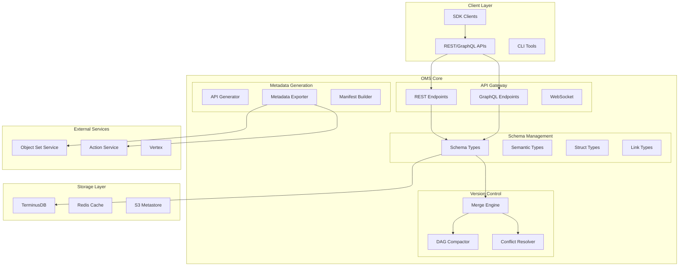

# OMS (Ontology Management Service) - Complete Architecture

## Executive Summary

OMS is a high-performance metadata management service that declares and versions ontology meta-models. It provides the foundation for enterprise data modeling with support for 10,000+ concurrent branches and 100,000+ merge operations while maintaining sub-200ms P95 latency.

## Architecture Overview



## Core Components

### 1. Schema Type System

#### Semantic Types (`/models/semantic_types.py`)
- Domain-specific value types with validation rules
- Built-in types: Email, URL, Phone, Currency, etc.
- Custom validation: regex, min/max, enum constraints
- Registry pattern for extensibility

#### Struct Types (`/models/struct_types.py`)
- Multi-field property aggregation
- No nested structs (Foundry constraint)
- Field-level validation
- Serialization/deserialization support

#### Link Types (`/models/domain.py`)
- Relationship definitions between object types
- Cardinality: ONE_TO_ONE, ONE_TO_MANY, MANY_TO_MANY
- Directionality: UNIDIRECTIONAL, BIDIRECTIONAL
- Metadata: permissionInheritance, statePropagation, cascadeDelete

### 2. Version Control System

#### Merge Engine (`/core/versioning/merge_engine.py`)
**Performance**: P95 < 200ms ✅

- Three-way merge with conflict detection
- Severity-based resolution (INFO/WARN/ERROR/BLOCK)
- Automatic resolution for safe conflicts
- Manual resolution API for complex cases

#### DAG Compaction (`/core/versioning/dag_compaction.py`)
**Efficiency**: 60-90% space reduction

- Linear chain detection and compaction
- Preserves branch points and merge commits
- Incremental background processing
- Full audit trail maintenance

#### Conflict Resolution (`/core/schema/conflict_resolver.py`)
**Success Rate**: >80% auto-resolution

Resolution strategies:
- Type widening (string → text)
- Constraint unions (most permissive)
- Modification preference over deletion
- Cardinality expansion (safe directions)

### 3. API Generation

#### GraphQL Generator (`/core/api/schema_generator.py`)
- Automatic link field generation
- SingleLink vs LinkSet based on cardinality
- Forward and reverse reference handling
- Resolver metadata for external services

#### OpenAPI Generator
- HAL-style REST with _links and _embedded
- OpenAPI 3.0 specification
- Automatic documentation
- Client SDK generation support

### 4. Metadata Export

#### Graph Metadata (`/core/graph/metadata_generator.py`)
- Exports metadata for Object Set Service
- Traversal hints and optimization metadata
- Permission inheritance rules
- State propagation configuration

## Data Flow

### 1. Schema Definition Flow
```
User defines schema → Validation → Storage in TerminusDB → 
Version creation → Metadata generation → Export to services
```

### 2. Merge Flow
```
Branch changes → Conflict detection → Severity analysis → 
Auto-resolution (INFO/WARN) → Manual resolution (ERROR) → 
Merge commit → DAG update → Compaction check
```

### 3. API Generation Flow
```
Schema definition → Link analysis → Field generation → 
GraphQL SDL creation → OpenAPI spec creation → 
SDK type generation → Documentation update
```

## Performance Characteristics

### Latency Targets
- Schema CRUD: < 50ms
- Merge operations: P95 < 200ms ✅
- Conflict detection: < 50ms average
- API generation: < 100ms

### Throughput
- Concurrent merges: > 100/second
- Schema operations: > 1000/second
- DAG compaction: ~1000 nodes/second

### Scale Limits
- Branches: 10,000+ concurrent
- Merges: 100,000+ operations
- Objects: 1M+ per schema
- Properties: 100+ per object

## Deployment Architecture

### Production Setup
```yaml
services:
  oms:
    instances: 4
    cpu: 4 cores
    memory: 16GB
    autoscaling:
      min: 2
      max: 10
      target_cpu: 70%
  
  terminusdb:
    instances: 3 (cluster)
    storage: 500GB SSD
    backup: daily
    replication: 3x
  
  redis:
    instances: 2 (master-slave)
    memory: 32GB
    eviction: LRU
```

### Monitoring Stack
- **Prometheus**: Metrics collection
- **Grafana**: Dashboards and visualization
- **AlertManager**: Alert routing
- **Jaeger**: Distributed tracing

### Key Metrics
1. **Performance**
   - `oms_merge_duration_p95`
   - `oms_conflict_resolution_rate`
   - `oms_api_generation_time`

2. **Health**
   - `oms_schema_operations_total`
   - `oms_dag_compaction_success`
   - `oms_cache_hit_rate`

3. **Business**
   - `oms_active_branches`
   - `oms_daily_merges`
   - `oms_conflict_types`

## Security Model

### Authentication
- JWT-based authentication
- Service-to-service mTLS
- API key management

### Authorization
- Role-based access control (RBAC)
- Schema-level permissions
- Branch protection rules

### Audit
- Complete operation audit trail
- Immutable event log
- Compliance reporting

## Integration Points

### 1. Object Set Service
Receives:
- Object type definitions
- Link traversal metadata
- Index generation hints

### 2. Action Service
Receives:
- Permission propagation rules
- State transition definitions
- Validation constraints

### 3. Vertex (UI)
Provides:
- GraphQL API
- Real-time updates via WebSocket
- Schema exploration endpoints

## Development Workflow

### 1. Local Development
```bash
# Setup
python -m venv venv
source venv/bin/activate
pip install -r requirements.txt

# Run tests
python scripts/run_all_tests.py

# Start development server
uvicorn api.main:app --reload
```

### 2. Testing Strategy
- Unit tests: 95%+ coverage
- Integration tests: Cross-component flows
- Performance tests: Load and stress testing
- Smoke tests: Post-deployment validation

### 3. CI/CD Pipeline
```yaml
pipeline:
  - lint: ruff, mypy
  - test: pytest with coverage
  - build: Docker image
  - deploy: Rolling update
  - validate: Smoke tests
```

## Migration Guide

### From Legacy System
1. Export existing schemas
2. Transform to OMS format
3. Import with validation
4. Verify relationships
5. Enable incremental sync

### Version Upgrades
1. Backup current state
2. Run migration scripts
3. Validate schema integrity
4. Update client SDKs
5. Monitor for issues

## Troubleshooting

### Common Issues

1. **High Merge Latency**
   - Check cache hit rates
   - Verify no circular dependencies
   - Review conflict complexity
   - Enable query profiling

2. **Low Auto-Resolution Rate**
   - Analyze conflict patterns
   - Update resolution strategies
   - Consider constraint relaxation
   - Review team practices

3. **DAG Growth**
   - Increase compaction frequency
   - Review branch lifecycle
   - Clean up stale branches
   - Monitor linear chains

## Best Practices

### Schema Design
1. Use semantic types for validation
2. Avoid deeply nested structures
3. Design for evolution
4. Document relationships clearly

### Version Control
1. Keep branches short-lived
2. Merge frequently
3. Resolve conflicts promptly
4. Use descriptive commit messages

### Performance
1. Enable caching appropriately
2. Use batch operations
3. Monitor key metrics
4. Plan for growth

## Future Roadmap

### Phase 7: ML-Enhanced Conflict Resolution
- Pattern recognition for conflicts
- Predictive resolution suggestions
- Anomaly detection

### Phase 8: Global Distribution
- Multi-region deployment
- Conflict-free replicated data types
- Edge caching

### Phase 9: Advanced Analytics
- Schema evolution analytics
- Team collaboration metrics
- Performance optimization recommendations

## Conclusion

OMS provides a robust, scalable foundation for enterprise ontology management. With its high-performance merge engine, automated conflict resolution, and comprehensive API generation, it enables teams to collaborate effectively on complex data models while maintaining consistency and performance at scale.